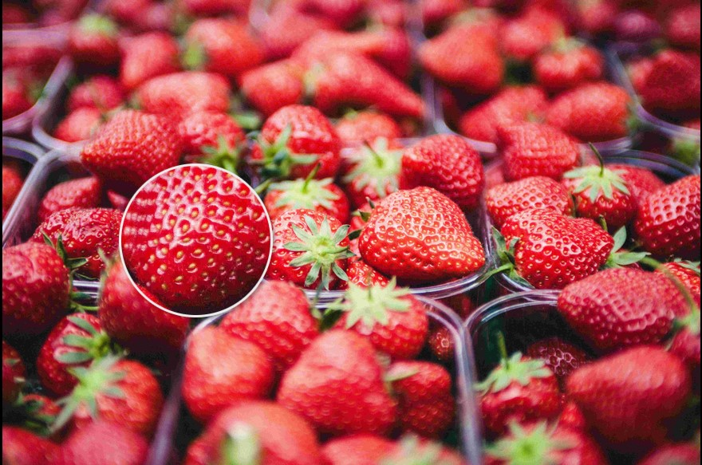

# svelte-magnifier

**Svelte image magnifier component**

- Simple and customizable
- Supports touch screens
- Allows different files for large image and magnifying glass (e.g. thumbnail and high-resolution image)

**[Demo](https://supercoww.github.io/svelte-magnifier)**

<p align="center">
  
</p>

## Usage

Install the package using NPM:

```sh
npm i -D svelte-magnifier
```

Add the component to your Svelte application:

```svelte
<script>
	import { Magnifier } from 'svelte-magnifier';
</script>

<Magnifier src="path/to/image.jpg" width="500px" />
```

## Configuration

| Prop             | Type    | Default    | Description                                                                                                                                                      |
| ---------------- | ------- | ---------- | ---------------------------------------------------------------------------------------------------------------------------------------------------------------- |
| `src` (required) | String  | –          | URL/path of the large image                                                                                                                                      |
| `alt` (required) | String  | –          | alt attribute of image                                                                                                                                           |
| `height`         | String  | `'auto'`   | Image height (absolute or relative values possible)                                                                                                              |
| `width`          | String  | `'100%'`   | Image width (absolute or relative values possible)                                                                                                               |
| `className`      | String  | `''`       | Class which will be applied to the image wrapper                                                                                                                 |
| `zoomImgSrc`     | String  | –          | URL/path of the image inside the magnifying glass (if not specified, the large image will be used)                                                               |
| `zoomFactor`     | Number  | `1.5`      | Factor by which the zoom image will be scaled (based on the size of the large image)                                                                             |
| `mgWidth`        | Number  | `150`      | Width of the magnifying glass in px                                                                                                                              |
| `mgHeight`       | Number  | `150`      | Height of the magnifying glass in px                                                                                                                             |
| `mgBorderWidth`  | Number  | `2`        | Border width of the magnifying glass in px                                                                                                                       |
| `mgShape`        | String  | `'circle'` | Shape of the magnifying glass (possible values: `'circle'`, `'square'`)                                                                                          |
| `mgShowOverflow` | Boolean | `true`     | Set this to `false` to cut off the magnifying glass at the image borders. When disabling `mgShowOverflow`, it's recommended that you also set all offsets to `0` |
| `mgMouseOffsetX` | Number  | `0`        | Horizontal offset of the magnifying glass in px when hovering with a mouse                                                                                       |
| `mgMouseOffsetY` | Number  | `0`        | Vertical offset of the magnifying glass in px when hovering with a mouse                                                                                         |
| `mgTouchOffsetX` | Number  | `-50`      | Horizontal offset of the magnifying glass in px when dragging on a touch screen                                                                                  |
| `mgTouchOffsetY` | Number  | `-50`      | Vertical offset of the magnifying glass in px when dragging on a touch screen                                                                                    |

Any other props will be passed down to the `` element.

## Custom styling

```svelte
<style>
	:global(.magnifier) {
		/* Styles for <div> around image and magnifying glass */
	}
	:global(.magnifier-image) {
		/* Styles for large image */
	}
	:global(.magnifying-glass) {
		/* Styles for magnifying glass */
	}
</style>
```

## Developing

Once you've created a project and installed dependencies with `pnpm install`, start a development server:

```bash
npm run dev

# or start the server and open the app in a new browser tab
npm run dev -- --open
```
